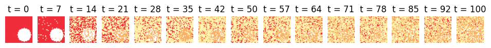
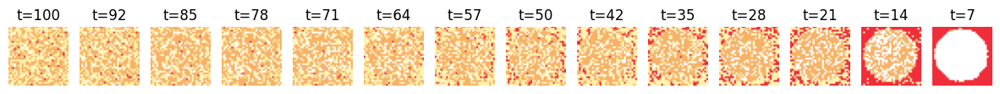

# Difussion Tiny Model

## Diffusion Model

This project demonstrates the use of a Diffusion Model to generate synthetic data, specifically images of simple **circles**. The model learns to reverse a gradual noising process, starting from random noise and reconstructing meaningful images.

## The Data

The dataset consists of black-and-white images of simple shapes, each of shape 32x32, generated using a synthetic data generation process. Each image contains a single shape with varying properties such as size, position, and rotation. The parameters for the shapes are:

- **Size**: Randomly selected within a defined range.
- **X-coordinate**: Random horizontal position of the shape's center.
- **Y-coordinate**: Random vertical position of the shape's center.

Below is a sample visualization of the generated data:

## Forward process

The forward process gradually adds Gaussian noise to the input image over a series of timesteps. This process transforms the original image into pure noise, following a predefined noise schedule.

## Reverse process

The reverse process learns to denoise the image step-by-step, starting from random noise and reconstructing the original image. This is achieved by training a tiny unet neural network to predict the noise at each timestep and iteratively removing it.

## Contributing

Contributions are welcome! Please feel free to submit a Pull Request. For major changes, please open an issue first to discuss what you would like to change.

- Fork the repository.
- Create your feature branch (git checkout -b feature/AmazingFeature).
- Commit your changes (git commit -m 'Add some AmazingFeature').
- Push to the branch (git push origin feature/AmazingFeature).
- Open a Pull Request.

Made with ❤️ by [Your Name]